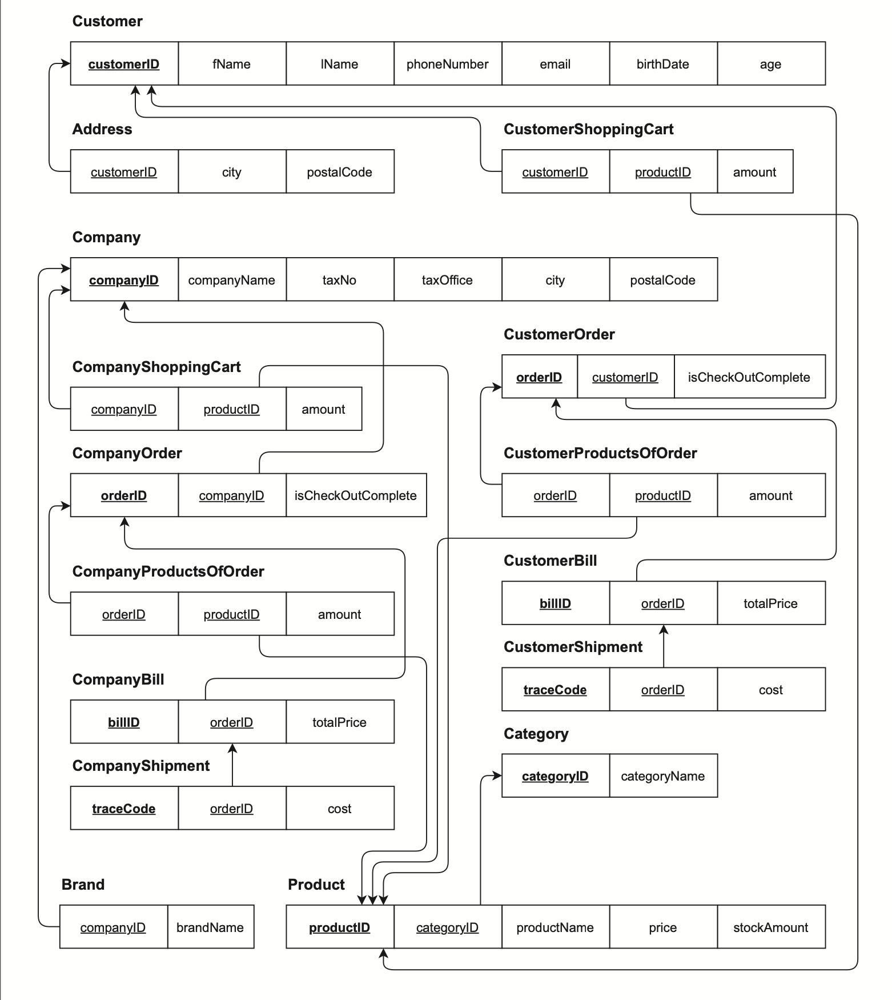

# Volkan Kozmetik Database

## Project Description
The purpose of this project is creating a database system, which will be implemented in **MS SQL** and proper integrations to a website for the **real company** named **Volkan Kozmetik**. Database will store the sell and stock information of the company that is specialized in personal care products and cologne.
## Business Requirements
### Functional Business Requirement
-  **Extensible:** The database must be restatable and changeable according to the information of customers and companies.
-  **Product Information:** The database system should store product information including product name, brand, price, quantity, and product description.
-  **Data Change Support:** Records must able to change.
### Non-Functional Business Requirement
- **Microsoft SQL Server:** The database must be created using Microsoft SQL Server 2019. 
- **Entity Relation Diagram:** A diagram that includes the relations of the entities in the database must be created.
- **Table for Each Entity:** Tables in the database must be created according to the entity names with correct attributes.

## Database Mapping Diagram

## Tables

**Address:** The address of the customer that can be multivalued. 
- **Columns** 
    - ``customerID (int)``
    - ``city (nvarchar(50))``
    - ``postalCode (int)``
- **Keys**
    - ``customerID (FK)``
---

**Brand:** The company’s brand for representing produced products.
- **Columns** 
    - ``companyID (int)``
    - ``brandName (nvarchar(50))``
- **Keys**
    - ``companyID (FK)``
---

- **Category:** Cluster of products. 

- **Columns** 
    - ``categoryID (int)`` 
    - ``ategoryName (nvarchar(50))``

- **Keys** 
    - ``companyID (FK)``
---

**Company:** The table that buys huge amounts of products and uses the factory for their brands to be produced.
- **Columns** 
    - ``companyID (int) (+Identity) ``
    - ``taxNo (bigint) (+Unique)`` 
    - ``companyName (nvarchar(50))(+Unique) ``
    - ``taxOffice (nvarchar(50))``
    - ``address (nvarchar(50))``
- **Keys** 
    - ``companyID (PK)``

---

**Company Bill:** Company bills are produced when the company checkouts the order. 
- **Columns** 
    - ``billID(int) (+Identity)``
    - ``orderID(int)``
    - ``totalPrice(decimal(10,2))``
- **Keys**
    - ``billID(PK)``
    - ``orderID(FK)``

---

**Company Order:** Company orders are produced when the company creates an order for a product to be produced.

- **Columns** 
    - ``orderID(int) (+Identity)``
    - ``companyID(int)``
    - ``isCheckOutComplete(int)``
- **Keys** 
    - ``orderID(PK)``
    - ``companyID(FK)``

---

**Company Product Of Order:** The product order that is the single element of the order. 
- **Columns**
    - ``orderID(int)``
    - ``productID(int)``
    - ``amount(int)``
- **Keys** 
    - ``orderID(FK) ``
    - ``productID(FK)``
- **Trigger** 
    - ``sp_autoDecrementStockAfterCompanyOrder``

---

**Company Shipment:** The shipment of the company that is created after the checkout is complete. 
- **Columns**
    - ``traceCode(int) (+Identity)``
    - ``orderID(int)``
    - ``cost(int)``
- **Keys** 
    - ``traceCode(PK)``
    - ``orderID(FK)``

---

**Company Shopping Card:** The shopping card of the company created when the company representative is adding products.
- **Columns**
    - ``companyID(int)``
    - ``productID(int)``
    - ``amount(int)``
- **Keys** 
    - ``companyID(FK) ``
    - ``productID(FK)``

---

**Customer:** The table for the person who buys small amounts of products and regular customers. 
- **Columns**
    - ``customerID(int) (+Identity))``
    - ``fName (nvarchar(50))``
    - ``lName (nvarchar(50))``
    - ``phoneNumber(nvarchar(50))``
    - ``email(nvarchar(50))``
    - ``birthDate(smalldatetime)``
    - ``age (int)(+Computed) ``
- **Keys**
    - ``customerID (PK)``

---

**Customer Bill:** Customer bills are produced when the customer checkouts the order. 
- **Columns**
    - ``billID(int) (+Identity)``
    - ``orderID(int)``
    - ``totalPrice(decimal(10,2))``
- **Keys**
    - ``billID(PK)``
    - ``orderID(FK)``

---

**Customer Order:** Customer orders are produced when the customer creates an order for a product to be produced.
- **Columns**
    - ``orderID(int) (+Identity) `` 
    - ``customerID(int) ``
    - ``isCheckOutComplete(int)``
- **Keys**
    - ``orderID(PK) ``
    - ``customerID(FK)``

- **Trigger** 
    - ``sp_autoDecrementStockAfterCustomerOrder``

---
**Customer Product Of Order:** The product order that is the single element of the order.

- **Columns** 
    - ``orderID(int)``  
    - ``productID(int) ``
    - ``amount(int)``

- **Keys** 
    - ``orderID(FK)`` 
    - ``productID(FK)``

---

**Customer Shipment:** The shipment of the customer that is created after the checkout is complete. 

- **Columns** 
    - ``traceCode(int) (+Identity) ``
    - ``orderID(int), cost(int)``

- **Keys** 
    - ``traceCode(PK) ``
    - ``orderID(FK)``

---

**Customer Shopping Card:** The shopping card of the customer created when the customer is adding products.

- **Columns**
    - ``customerID(int) ``
    - ``productID(int)``
    - ``amount(int)``

- **Keys** 
    - ``customerID(FK) ``
    - ``productID(FK)``

---

**Product:** The shopping card of the customer created when the customer is adding products. 
- **Columns** 
    - ``productID(int)``
    - ``categoryID(int)``
    - ``stockAmount(int)``
    - ``productName(nvarchar(50))``
    - ``price (decimal(10,2))``

- **Keys** 
    - ``productID(PK)``
    - ``categoryID(FK)``
---
## Views

1) **avgOrderPrice_Istanbul**

Display the average price of the all orders which was given in Istanbul.

2) **mostOrderedProduct**
Display the most ordered product.

3) **orderCountByCity**
Display the order counts according to the cities.

4) **orderCountByCategory**
Display the order counts according to the categories.

5) **mostPurchasedCompany**
Display the top 3 companies that spended most money

## Triggers

1) **sp_autoDecrementStockAfterCustomerOrder**

- **Definition:** This trigger updates the product stock amount when a customer orders a product.
- **How it works:** By keeping track of what has been inserted to the customer’s ordered product(s) list, trigger gets an inserted table. With the help of this table, trigger finds which product(s) have been purchased and decrements the stock amount of those products according to this situation.

2. **sp_autoDecrementStockAfterCompanyOrder**
- **Definition:** This trigger updates the product stock amount when a company orders a product.
- **How it works:** By keeping track of what has been inserted to the company’s ordered product(s) list, trigger gets an inserted table. With the help of this table, trigger finds which product(s) have been purchased and decrements the stock amount of those products according to this situation.

## Stored Procedures

1. **sp_addProductAmount(productId, amountToAdd)**
- **Definition:** Increments a product’s stock amount by the given amount. 
- **How it works:** Works by updating the product table’s stock amount.

2. **sp_removeProductAmount (productId, amountToAdd)**
- **Definition:** Decrements a product’s stock amount by the given amount. 
- **How it works:** Works by updating the product table’s stock amount.

3. **sp_addNewProduct (category, name, price)** 
 - **Definition:** Adds a new product.
 - **How it works:** Works by inserting given parametes into product table.

4. **sp_addIntoCustomerShoppingCart (customerID, productId, amount)**
 - **Definition:** Adds the given product by the given amount into the customer’s shopping cart or updates existing amount.
 - **How it works:** Works by inserting to CustomerShoppingCart table or updating existing amount in the cart.

5. **sp_addNewCustomerOrder (customerID)**
 - **Definition:** Creates a new order for the customer by using the values in customer’s shopping cart. Empties the cart.
 - **How it works:** Works by inserting to customer order table and products of the order table. Deletes the cart’s values.

6. **sp_addIntoCompanyShoppingCart (companyID, productId, amount)**
 - **Definition:** Adds the given product by the given amount into the company’s shopping cart or updates existing amount.
 - **How it works:** Works by inserting to CompanyShoppingCart table or updating existing amount in the cart.

7. **sp_addNewCompanyOrder (companyID)**
- **Definition:** Creates a new order for the company by using the values in company’s shopping cart. Empties the cart.
- **How it works:** Works by inserting to company order table and products of the order table. Deletes the cart’s values.

8. **sp_approveCustomerOrder (customerID)**
- **Definition:** Completes the customer’s checkout and creates a bill for the order.
- **How it works:** Works by updating customer order table and inserting a new bill into the bill table. Calculates total cost for the products.

9. **sp_approveCompanyOrder (companyID)**
- **Definition:** Completes the company’s checkout and creates a bill for the order.
- **How it works:** Works by updating company order table and inserting a new bill into the bill table. Calculates total cost for the products.

10. **sp_registerNewCustomer (fName, lName, phoneNumber, email, birthDate)** 
- **Definition:** Adds a new customer to the system.
- **How it works:** Works by inserting personal details into Customer table and addres details into address table.

11. **sp_registerNewCompany (taxNo, companyName, taxOffice, address)**
- **Definition:** Adds a new company to the system.
- **How it works:** Works by inserting given company details into Company table.

12. **sp_createNewCategory (categoryName)**
- **Definition:** Adds a new category to the system.
- **How it works:** Works by inserting given category name into category table.

13. **sp_shipToCustomer (orderID)**
- **Definition:** Ships the billed-order to the customer. Calculates a shipment cost.
- **How it works:** Works by inserting a new row into shipment table. SP links the given orderID to shipment details. Calculates a random cost depending on the total amount of the items.

14. **sp_shipToCompany (orderID)**
- **Definition:** Ships the billed-order to the company. Calculates a shipment cost.
- **How it works:** Works by inserting a new row into shipment table. SP links the given orderID to shipment details. Calculates a random cost depending on the total amount of the items.

